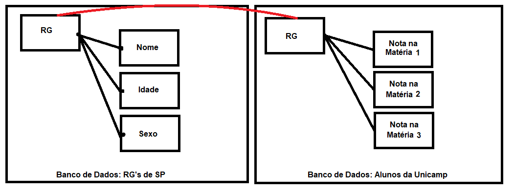

# Tarefa 01
#### Clique aqui para ver a parte 1: 
#### Clique aqui para ver a parte 2: 

# Tarefa 02
#### Imagem Engenharia Reversa:

#### A cima meu esquema sobre como poderíamos fazer uma engenharia reversa com os dados que usamos. Podemos pensar que uma tabela, no caso, o Banco de Dados dos habitaantes do estado de SP tem um atributo (RG) que pode ser linkado com a mesma informação, porém que está presente em uma _outra_ tabela, permitindo-se a obtenção de mais dados.
