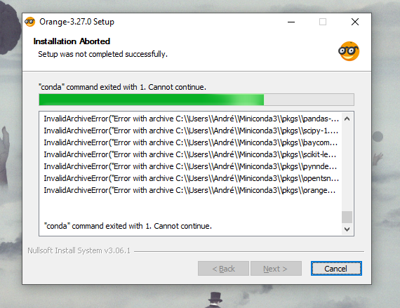
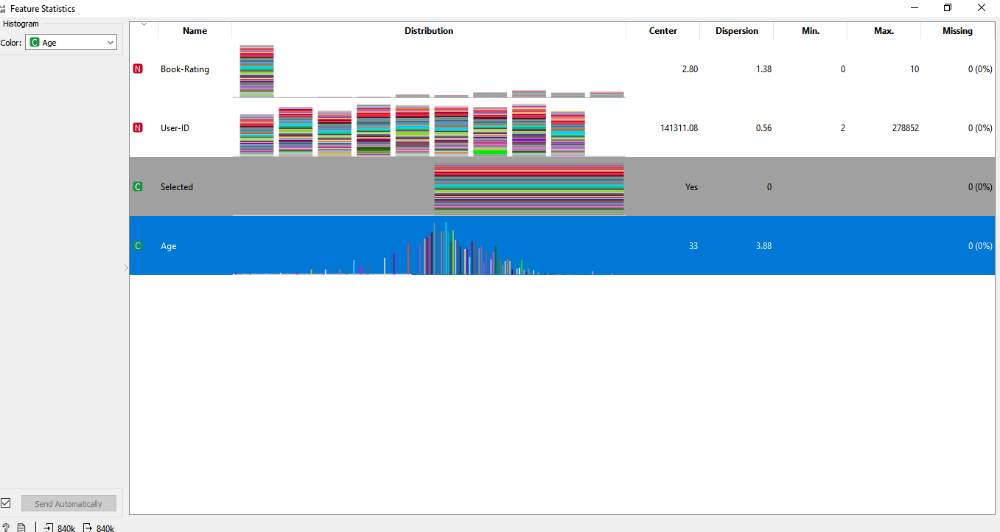

## LAB03: ORANGE
##### Neste Lab deveríamos apresentar uma análise interessante usando um csv à escolha.

Nos primeiros dias obtive muitos erros na instalação, onde ocorria algum erro no conda e ele não conseguia concluí-la com sucesso:
 
Isso acabou atrasando bastante as coisas. 

Após baixar uma versão mais antiga do conda e o Orange Portátil ele acabou funcionando.
 
##### Após a instalação dar certo
Produziu-se o arquivo ddo Orange:
[Arquivo orange](www.......)

Dá já para ver que o banco de dados conta um público de, em sua maioria, meia idade; Umas coisas curiosas que acabei percebendo foi que houve diversos inputs de idades acima de 100 anos, chegando a 140, 240 anos, provavelmente por causa de algum erro/falta de checagem na hora de se fazer o questionário.  
Outra coisa que pude perceber foi que há uma quantidade absurda de usuários que votaram em 0(ZERO) na avaliação do livro, como pode ser visto na imagem:
 
